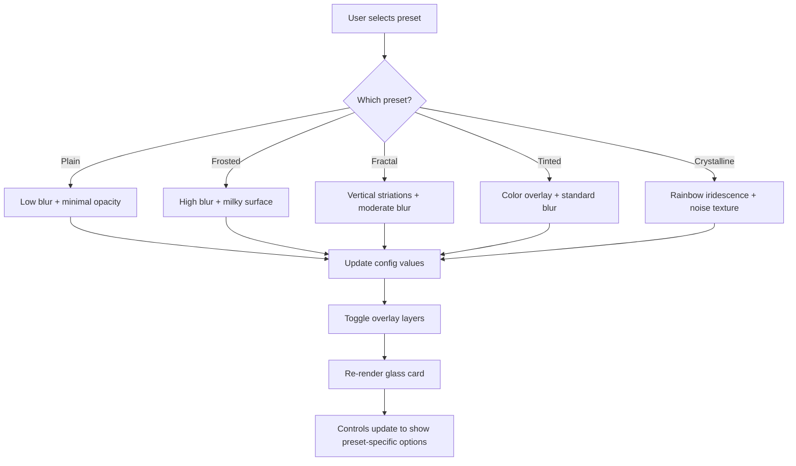

# Liquid Glass Component — Preset System Improvement Plan

> **Status**: Phase 1 (5 presets) ✅ implemented. Phase 2 (4 new presets) planned below.

---

## Phase 2 — New Presets

### 6. Holographic (Dichroic Glass)
- **Concept**: Glass that shifts color based on viewing angle. The hue rotates as the cursor moves across the surface, simulating dichroic/holographic film on glass.
- **Config values**: `blur: 14`, `opacity: 0.12`, `borderOpacity: 0.3`, `saturation: 2.0`
- **Reflection**: Prominent — `reflectionSize: 160`, `reflectionOpacity: 0.45`, `reflectionBlur: 35`
- **Extra layers**:
  - **Holographic gradient overlay**: A conic-gradient centered on the cursor position that creates a rainbow halo effect. The gradient origin follows the mouse.
  - **New config properties**: `holoIntensity` (default 0.2), `holoSpread` (size of the holo effect, default 200px)
- **Key CSS technique**:
  - `conic-gradient(from var(--holo-angle), red, orange, yellow, green, cyan, blue, violet, red)` positioned at cursor
  - The `--holo-angle` rotates based on cursor X position (via JS updating a CSS variable)
  - `mix-blend-mode: color-dodge` at low opacity
  - The gradient position updates via GSAP on mousemove

### 7. Gradient
- **Concept**: Top-to-bottom gradient opacity — darker/more opaque at the top, clearer at the bottom. Like automotive windshield tint strips or gradient sunglasses.
- **Config values**: `blur: 18`, `opacity: 0.15`, `borderOpacity: 0.25`, `saturation: 1.6`
- **Reflection**: Standard — `reflectionSize: 140`, `reflectionOpacity: 0.35`, `reflectionBlur: 40`
- **Extra layers**:
  - **Gradient mask overlay**: A vertical gradient from opaque to transparent that modulates the glass density
  - **New config properties**: `gradientDirection` (default 'top-to-bottom', options: 'top-to-bottom', 'bottom-to-top', 'left-to-right', 'right-to-left'), `gradientStrength` (default 0.3 — how opaque the dense end is)
- **Key CSS technique**:
  - An overlay div with `background: linear-gradient(to bottom, rgba(255,255,255, var(--gradient-strength)), transparent)`
  - Combined with a matching border opacity gradient using `mask-image: linear-gradient(to bottom, black, transparent)` on the glass itself

### 8. Wet (Rain Glass)
- **Concept**: Glass with water droplets and rain streaks running down the surface. Simulates looking through a rain-covered window.
- **Config values**: `blur: 10`, `opacity: 0.1`, `borderOpacity: 0.2`, `saturation: 1.4`
- **Reflection**: Subtle — `reflectionSize: 100`, `reflectionOpacity: 0.3`, `reflectionBlur: 45`
- **Extra layers**:
  - **Droplet layer**: Multiple CSS `radial-gradient` circles at pseudo-random positions creating water droplet lensing effect
  - **Streak layer**: Vertical linear gradients at slight angles simulating rain streaks
  - **New config properties**: `dropletDensity` (default 'medium', options: 'sparse', 'medium', 'heavy'), `streakOpacity` (default 0.15)
- **Key CSS technique**:
  - Droplets: `background: radial-gradient(circle 4px at 20% 15%, rgba(255,255,255,0.4) 0%, transparent 100%), radial-gradient(circle 3px at 45% 30%, ...)` — multiple radial gradients composited
  - Streaks: `background: repeating-linear-gradient(175deg, transparent, transparent 20px, rgba(255,255,255,0.08) 20px, rgba(255,255,255,0.08) 21px)` for thin vertical rain lines
  - Both layers use `mix-blend-mode: overlay`
  - Optional: Slow downward animation on streaks to simulate rain movement

### 9. Apple (iOS Liquid Glass / Refraction)
- **Concept**: Apple's iOS-style "liquid glass" with strong refraction, edge light bending, and a subtle inner shadow that creates depth. The glass appears to physically bend light at its edges.
- **Config values**: `blur: 24`, `opacity: 0.08`, `borderOpacity: 0.4`, `saturation: 1.9`
- **Reflection**: Large and soft — `reflectionSize: 200`, `reflectionOpacity: 0.3`, `reflectionBlur: 50`
- **Extra layers**:
  - **Edge refraction**: A bright edge highlight that's stronger at the top and fades, simulating light bending around the glass edge. Uses `box-shadow: inset 0 1px 0 rgba(255,255,255,0.5), inset 0 -1px 0 rgba(0,0,0,0.1)`
  - **Inner depth shadow**: `box-shadow: inset 0 4px 30px rgba(0,0,0,0.1)` for the "sunk into the surface" feel
  - **Specular highlight**: A subtle top-edge gradient that simulates the bright specular reflection Apple uses
  - **New config properties**: `refractionStrength` (default 0.5 — controls edge highlight intensity), `depthShadow` (default 0.1 — inner shadow opacity)
- **Key CSS technique**:
  - Multiple `box-shadow` layers: outer glow + inner highlight + inner depth shadow
  - Top specular: `background: linear-gradient(to bottom, rgba(255,255,255,0.3) 0%, transparent 40%)` overlay
  - Higher blur than other presets for the characteristic Apple "deep blur"
  - Border uses gradient from bright white at top to subtle at bottom: `border-image: linear-gradient(to bottom, rgba(255,255,255,0.5), rgba(255,255,255,0.1)) 1`
  - The overall effect should feel like the glass is a physical lens sitting on the surface

---

## Phase 2 — Implementation Steps

1. **Extend config ref** with new properties: `holoIntensity`, `holoSpread`, `gradientDirection`, `gradientStrength`, `dropletDensity`, `streakOpacity`, `refractionStrength`, `depthShadow`
2. **Add 4 new preset definitions** to the `glassPresets` array
3. **Import new icons** from lucide-vue-next: `Rainbow` (Holographic), `ArrowDownToLine` (Gradient), `CloudRain` (Wet), `Apple`/`Smartphone` (Apple)
4. **Add overlay DOM elements** for each new preset:
   - Holographic: conic-gradient div that follows cursor
   - Gradient: vertical gradient overlay div
   - Wet: droplet + streak overlay divs
   - Apple: specular highlight div + box-shadow styles
5. **Add mousemove handler updates** for Holographic (update CSS variable for gradient position)
6. **Add conditional controls** for each preset's unique properties
7. **Update code generation** for each preset
8. **Update About section** with new preset descriptions

---

## Phase 2 — Architecture Notes

### Mouse-reactive Holographic Effect
The holographic preset requires updating CSS custom properties on mousemove:
```typescript
// In onMouseMove handler, add:
if (activePreset.value === 'Holographic' && holoRef.value) {
  const angle = (x / rect.width) * 360
  holoRef.value.style.setProperty('--holo-angle', `${angle}deg`)
  holoRef.value.style.setProperty('--holo-x', `${x}px`)
  holoRef.value.style.setProperty('--holo-y', `${y}px`)
}
```

### Wet Droplet Generation
Pre-generate droplet positions as a computed CSS string to avoid runtime overhead:
```typescript
const dropletBackground = computed(() => {
  const positions = generateDropletPositions(config.value.dropletDensity)
  return positions.map(p =>
    `radial-gradient(circle ${p.size}px at ${p.x}% ${p.y}%, rgba(255,255,255,${p.opacity}) 0%, transparent 100%)`
  ).join(', ')
})
```

### Apple Refraction Box Shadows
```css
.glass-apple {
  box-shadow:
    /* Outer subtle glow */
    0 8px 32px rgba(0, 0, 0, 0.12),
    /* Inner top highlight (refraction) */
    inset 0 1px 0 rgba(255, 255, 255, calc(var(--refraction-strength) * 1)),
    inset 1px 0 0 rgba(255, 255, 255, calc(var(--refraction-strength) * 0.5)),
    inset -1px 0 0 rgba(255, 255, 255, calc(var(--refraction-strength) * 0.5)),
    /* Inner depth shadow */
    inset 0 4px 30px rgba(0, 0, 0, var(--depth-shadow));
}
```

---

## Overview

Enhance `app/pages/lab/liquid-glass.vue` with a preset system featuring **5 glass styles**: Plain, Frosted, Fractal, Tinted, and Crystalline. Each preset applies a distinct visual treatment to the glass card while keeping all existing controls functional for fine-tuning.

---

## Preset Definitions

### 1. Plain
- **Concept**: Minimal, nearly transparent glass. Just a hint of surface.
- **Config values**: `blur: 4`, `opacity: 0.05`, `borderOpacity: 0.15`, `saturation: 1.0`
- **Reflection**: Small and subtle — `reflectionSize: 80`, `reflectionOpacity: 0.15`, `reflectionBlur: 50`
- **Extra layers**: None — no overlay effects

### 2. Frosted (current default behavior)
- **Concept**: Classic glassmorphism with heavy blur and milky surface.
- **Config values**: `blur: 20`, `opacity: 0.15`, `borderOpacity: 0.3`, `saturation: 1.8`
- **Reflection**: Standard — `reflectionSize: 150`, `reflectionOpacity: 0.4`, `reflectionBlur: 40`
- **Extra layers**: None — the existing behavior

### 3. Fractal (Reeded/Ribbed Glass)
- **Concept**: Vertical striations that distort the background like ribbed glass panels. Based on the reference image showing vertical slat-like refractions.
- **Config values**: `blur: 8`, `opacity: 0.08`, `borderOpacity: 0.2`, `saturation: 1.5`
- **Reflection**: Subtle — `reflectionSize: 120`, `reflectionOpacity: 0.25`, `reflectionBlur: 30`
- **Extra layers**:
  - **Vertical striation overlay**: Repeating vertical gradient strips using CSS `repeating-linear-gradient` that create the ribbed glass look
  - **New config properties**: `striationWidth` (width of each rib, default 8px), `striationOpacity` (default 0.3)
  - The striations modulate transparency — alternating between more and less transparent vertical bands
  - Optional: SVG `feTurbulence` + `feDisplacementMap` filter for more organic distortion

### 4. Tinted
- **Concept**: Colored glass — like looking through stained or tinted glass.
- **Config values**: `blur: 16`, `opacity: 0.2`, `borderOpacity: 0.25`, `saturation: 2.0`
- **Reflection**: Standard — `reflectionSize: 140`, `reflectionOpacity: 0.35`, `reflectionBlur: 40`
- **Extra layers**:
  - **Tint color overlay**: A semi-transparent colored layer on top of the glass
  - **New config properties**: `tintColor` (hex color, default `#3b82f6` blue), `tintOpacity` (default 0.15)
  - **Tint sub-presets**: Blue, Rose, Amber, Emerald, Violet — quick color picks

### 5. Crystalline
- **Concept**: Prismatic/iridescent glass with rainbow refraction and noise texture.
- **Config values**: `blur: 12`, `opacity: 0.1`, `borderOpacity: 0.35`, `saturation: 2.2`
- **Reflection**: Prominent — `reflectionSize: 180`, `reflectionOpacity: 0.5`, `reflectionBlur: 35`
- **Extra layers**:
  - **Iridescent gradient overlay**: Animated multi-color gradient (rainbow) at low opacity that shifts with mouse position
  - **Noise/grain texture**: CSS-generated noise using SVG `feTurbulence` filter for crystalline surface texture
  - **New config properties**: `iridescenceOpacity` (default 0.15), `noiseOpacity` (default 0.08)

---

## Architecture Changes

### New Data Structures

```typescript
// Preset type definition
interface GlassPreset {
  name: string
  description: string
  config: Partial<GlassConfig>
  // Which overlay layers are active
  layers: {
    striation: boolean
    tint: boolean
    iridescence: boolean
    noise: boolean
  }
}

// Extended config with new properties
interface GlassConfig {
  // Existing
  blur: number
  opacity: number
  borderOpacity: number
  saturation: number
  reflectionSize: number
  reflectionOpacity: number
  reflectionBlur: number
  tiltStrength: number
  tiltDuration: number
  dragEnabled: boolean
  dragEase: number
  // New — Fractal
  striationWidth: number
  striationOpacity: number
  // New — Tinted
  tintColor: string
  tintOpacity: number
  // New — Crystalline
  iridescenceOpacity: number
  noiseOpacity: number
}
```

### Preset Selector UI

Add a horizontal preset selector bar above the existing controls section, similar to the metal preset dropdown in `liquid-metal.vue` but as **visual pill buttons** for better UX:

```
[ Plain ] [ Frosted ] [ Fractal ] [ Tinted ] [ Crystalline ]
```

Each button shows the preset name. The active preset is highlighted. Clicking a preset applies all its config values and activates/deactivates the appropriate overlay layers.

### Overlay Layers (New DOM Elements)

Add conditional overlay elements inside the glass card:

1. **Striation layer** — `v-if="activePreset === 'Fractal'"` — vertical repeating gradient
2. **Tint layer** — `v-if="activePreset === 'Tinted'"` — colored overlay div
3. **Iridescence layer** — `v-if="activePreset === 'Crystalline'"` — animated rainbow gradient
4. **Noise layer** — `v-if="activePreset === 'Crystalline'"` — SVG noise filter overlay

### Controls Section Updates

Add preset-specific controls that appear conditionally:

- **Fractal active**: Show striation width and opacity sliders
- **Tinted active**: Show tint color picker + tint opacity slider + tint sub-preset buttons
- **Crystalline active**: Show iridescence opacity and noise opacity sliders

### Code Generation Updates

Update `generatedCode` computed property to include the active preset's CSS — striation CSS, tint CSS, or crystalline CSS as appropriate.

---

## Implementation Steps

1. **Add preset data structure** — Define the 5 presets array with all config values and layer flags
2. **Extend config ref** — Add new properties: `striationWidth`, `striationOpacity`, `tintColor`, `tintOpacity`, `iridescenceOpacity`, `noiseOpacity`
3. **Add preset selector UI** — Horizontal pill buttons above controls
4. **Add `applyPreset` function** — Sets config values and tracks active preset
5. **Add overlay DOM elements** — Striation, tint, iridescence, and noise layers inside the glass card
6. **Add CSS for new layers**:
   - Striation: `repeating-linear-gradient` with alternating transparent/semi-opaque vertical bands
   - Tint: Simple colored div with configurable opacity
   - Iridescence: Multi-stop gradient with animation
   - Noise: Inline SVG filter with `feTurbulence`
7. **Add conditional controls** — Preset-specific sliders and color pickers
8. **Update code generation** — Include preset-specific CSS in the generated output
9. **Update About section** — Add descriptions for each preset type
10. **Test all presets** — Verify each preset applies correctly and controls work

---

## Visual Flow



---

## Key CSS Techniques

### Fractal Striations
```css
.striation-layer {
  background: repeating-linear-gradient(
    90deg,
    transparent 0px,
    transparent var(--striation-width),
    rgba(255, 255, 255, var(--striation-opacity)) var(--striation-width),
    rgba(255, 255, 255, var(--striation-opacity)) calc(var(--striation-width) * 2)
  );
}
```

### Tint Overlay
```css
.tint-layer {
  background-color: var(--tint-color);
  opacity: var(--tint-opacity);
  mix-blend-mode: overlay;
}
```

### Crystalline Iridescence
```css
.iridescence-layer {
  background: linear-gradient(
    135deg,
    rgba(255, 0, 0, 0.1),
    rgba(255, 165, 0, 0.1),
    rgba(255, 255, 0, 0.1),
    rgba(0, 255, 0, 0.1),
    rgba(0, 0, 255, 0.1),
    rgba(128, 0, 128, 0.1)
  );
  mix-blend-mode: color-dodge;
  animation: iridescenceShift 6s ease-in-out infinite;
}
```

### Noise Texture (SVG Filter)
```html
<svg width="0" height="0">
  <filter id="noise">
    <feTurbulence type="fractalNoise" baseFrequency="0.65" numOctaves="3" />
    <feColorMatrix type="saturate" values="0" />
  </filter>
</svg>
```
